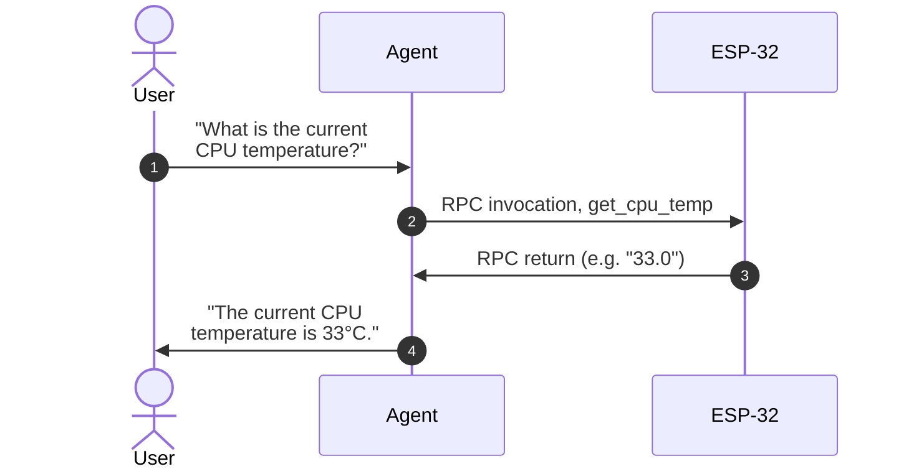
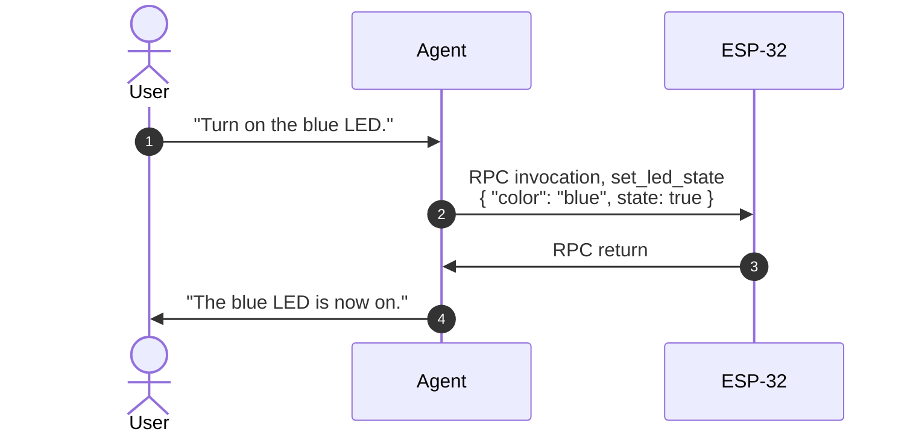

# ESP-32 Example Agent

A simple example agent built with [LiveKit Agents](https://docs.livekit.io/agents/) to be paired with the ESP-32 [voice chat example](../README.md). The agent is designed to demonstrate hardware interaction in response to user requests:

1. Read CPU temperature:

> **User:** What is the current CPU temperature? \
> **Agent:** The CPU temperature is currently 33°C.



2. Control on-board LED state:

> **User:** Turn on the blue LED. \
> **Agent:** The blue LED is now on.

> **User:** Turn on the yellow LED. \
> **Agent:** I'm sorry, the board does not have a yellow LED.



## Usage

For a quick introduction to LiveKit Agents, please refer to the [docs](https://docs.livekit.io/agents/). Once the agent is running, it will automatically join the same room as the ESP-32 after the device connects. Follow these steps to get up and running:

1. Set required environment variables:

```sh
OPENAI_API_KEY=<Your OpenAI API Key>
CARTESIA_API_KEY=<Your Cartesia API Key>
LIVEKIT_API_KEY=<your API Key>
LIVEKIT_API_SECRET=<your API Secret>
LIVEKIT_URL=<your server URL>
```

2. Run agent

```sh
python agent.py download-files
python agent.py dev
```

3. Launch ESP-32 voice chat example (see [README](../README.md)).
